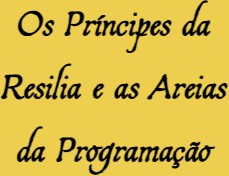
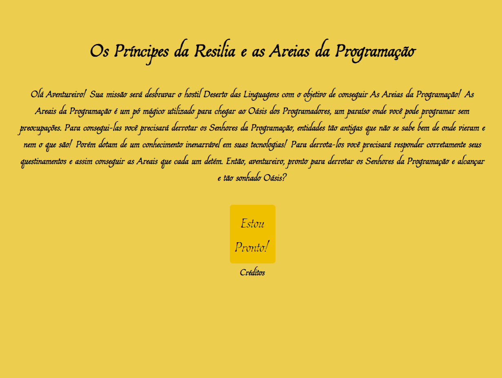

 

    

  <h3 align="center">Os Príncipes da Resilia e as Areias da Programação by <a href="https://github.com/brunoandreotti">Bruno</a></h3>
  
  

     Jogo desenvolvido por <a class="credits" href="https://www.linkedin.com/in/bruno-andreotti-9384411b4/" target="_blank">Bruno Andreotti</a> como projeto final do Módulo 1 do curso de Desenvolvedor Web FullStack da <a class="credits" href="https://www.resilia.com.br" target="_blank">Resilia Educação</a>
      

  <a href="#sobre"> Sobre </a> |
  <a href="#historia"> História </a> |
  <a href="#rodando-o-projeto"> Acessando o projeto </a> |  
  <a href="#tecnologias-utilizadas"> Tecnologias utilizadas </a>      
        
     
    <h1 align="center">
    
 </h1>
  

# Sobre

O objetivo do projeto foi criar um jogo de escolhas com a finalidade de colocar em prática os conhecimentos que adquiri até o momento!

# História:

A missão dos personagens é desbravar o hostil Deserto das Linguagens com o objetivo de conseguir As Areias da Programação! As Areais da Programação é um pó mágico utilizado para chegar ao Oásis da Programação, um paraíso onde você pode programar sem preocupações. Para consegui-las você precisará derrotar os Senhores da Programação, entidades tão antigas que não se sabe bem de onde vieram e nem o que são! Porém dotam de um conhecimento inenarrável em suas tecnologias! Para derrota-los você precisará responder corretamente seus questinamentos e assim conseguir as Areais que cada um detém.

# Acessando o projeto:

Você pode acessar o jogo <a href="https://brunoandreotti.github.io/Areias-da-Programa-o/index.html"> clicando Aqui! </a>

# Tecnologias utilizadas:

  

---

**Desenvolvido por [Bruno Andreotti](https://www.linkedin.com/in/bruno-andreotti-9384411b4/).**
